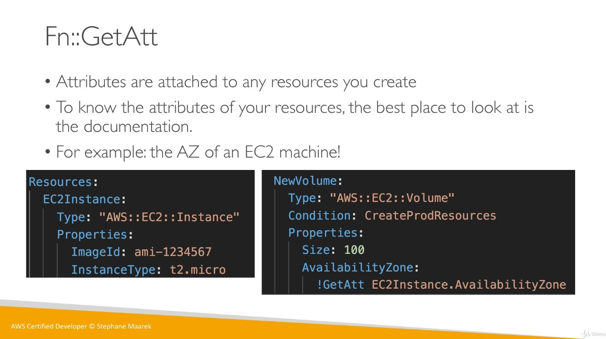

# CloudFormation

## Resources

Resources are the core of your CloudFormation template. They represent the different AWS Components that will be created and configured.

- Resource type identifiers are of the form:
  - `AWS::aws-product-name::data-type-name`
  - 224 resources total
  - [CloudFormation resource identifiers](https://docs.aws.amazon.com/AWSCloudFormation/latest/UserGuide/aws-template-resource-type-ref.html)

## Parameters

Parameters are a way to provide inputs to your AWS CloudFormation template. They're important to know if:

- You want to *reuse* your template across the company.
- Some inputs can not be determined ahead of time.

You should use a parameter if your CloudFormation resource configuration is likes to change in the future. Then you won't need to re-upload a template to changes its contents.

The `Fn::Ref` function can be leveraged to reference parameters. The shorthand for this in YAML is `!Ref`. Parameters can be used anywhere in a template.

```yaml
DbSubnet1:
  Type: AWS::EC2::Subnet
  Properties:
    VpcId: !Ref MyVPC
```

AWS also offers pseudo parameters that can be used at any time and are enabled by default.

Reference Value | Example Return Value
--------------- | --------------------
`AWS::AccountId` | `1234567890`
`AWS::NotificationARNs` | `[arn:aws:sns:us-east-1:123456789012:MyTopic]`
`AWS::NoValue` | `Does not return a value.`
`AWS::Region` | `us-east-2`
`AWS::StackId` | `arn:aws:cloudformation:us-east-1:123456789012:stack/MyStack/1c2fa629-132s-55g2-aff3-30v2415249v0`
`AWS::StackName` | `MyStack`

## Mappings

Mappings are fixed variables within your CloudFormation Template. They're handy to differentiate between different environments (dev vs. prod), regions, AMI types, etc. All the values are hardcoded within the template.

```yaml
Mappings:
  Mapping01:
    Key01:
      Name: Value01
    Key02:
      Name: Value02
    Key03:
      Name: Value03
```

Mappings are great when you know in advance all the values that can be taken and that they can be deduced from variables such as:

- Region
- Availability Zone
- AWS Account
- Environment (dev vs. prod)

Mappings allow safer control over the template. Comparatively, use parameters when the values are really user specific.

Use `Fn::FindInMap` to return a named value from a specific key.

`!FindInMap [ MapName, TopLevelKey, SecondLevelKey ]`

```yaml
AWSTemplateFormatVersion: "2019-09-09"
Mappings:
  RegionMap:
    us-east-1:
      "32": "ami-6411e20d"
      "64": "ami-6a11e213"
    us-west-1:
      "32": "ami-c9c7979e"
      "64": "ami-cdc8956f"
Resources:
  myEc2Instance:
    Type: "AWS::EC2::Instance"
    Properties:
      ImageId: !FindInMap [RegionMap, !Ref "AWS::Region", 32]
      InstanceType: m1.small
```

## Outputs

The Outputs section declares *optional* output values that we can import into other stacks.

They've very useful for example if you define a network CloudFormation, and output the variables such as VPC ID and your Subnet IDs.

It's the best way to perform some collaboration cross stack, as you let experts handle their own part of the stack.

You can't delete a CloudFormation stack if its outputs are being referenced by another CloudFormation stack.

An example would be to create an SSH Security Group as part of one template. We create an output that references that security group.

```yaml
Outputs:
  StackSSHSecurityGroup:
    Description: The SSH Security Group for our Company
    Value: !Ref MyCompanyWideSSHSecurityGroup
    Export:
      Name: SSHSecurityGroup
```

To reference it, use the `Fn::ImportValue` function.

```yaml
Resources:
  MySecureInstance:
    Type: AWS:EC2::Instance
    Properties:
      AvailabilityZone: us-east-1a
      ImageId: ami-a4v2fje3
      InstanceType: t2.micro
      SecurityGroups:
        - !ImportValue SSHSecurityGroup
```

## Conditions

Conditions are used to control the creation of resources or outputs based on a condition. Think `if` statements. Common conditions can be anything, but common ones are:

- Environment (dev / test / prod)
- AWS Region
- Any parameter value

```yaml
# Create resources if the EnvType is equal to "prod"
Conditions:
  CreateProdResources: !Equals [ !Ref EnvType, prod ]
```

The intrinsic function can be any of the following:

- `FN::And`
- `FN::Equals`
- `FN::If`
- `FN::Not`
- `FN::Or`

```yaml
Resources:
  MountPoint:
    Type: "AWS::EC2::VolumeAttachment"
    Condition: CreateProdResources
```

## Intrinsic Functions

Must-know intrinsic functions:

- `Ref`
- `FN::GetAtt`: Get the attribute of a resources.
- `FN::FindInMap`
- `FN::ImportValue`
- `FN::Join`
- `FN::Sub`
- Condition Functions (`Fn::If`, `Fn::Not`, `Fn::Equals`, etc.)



`Fn::Join` joins values with a delimiter.

`!Join [ delimiter, [comma-delimited list of values] ]`

Which creates `a:b:c`

`!Join [ ":" [a, b, c] ]`

`Fn::Sub`, or !Sub, allows you to substitute variables from a text. The string must contain `${VariableName}` which will substitute them.

```yaml
!Sub
  - String
  - { Var1Name: Var1Value, Var2Name: Var2Value}
```

## Rollbacks

- Stack creation fails:
  - Default: everything rolls back (gets deleted). We can look at the log.
  - Option to disable rollback and troubleshoot what happened.
- Stack update fails:
  - Stack automatically rolls back to the previous known working state.
  - Ability to see in the log what happened and error messages.
