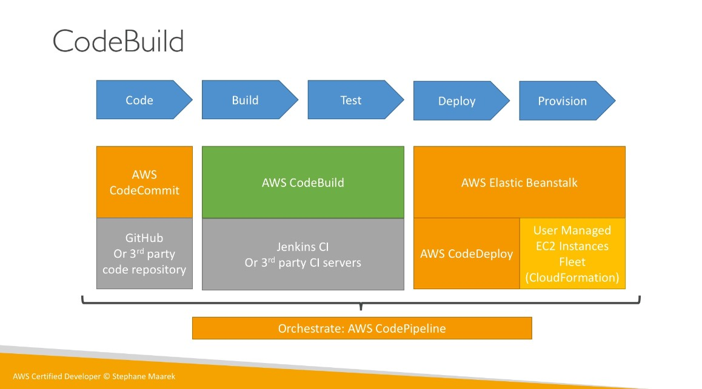
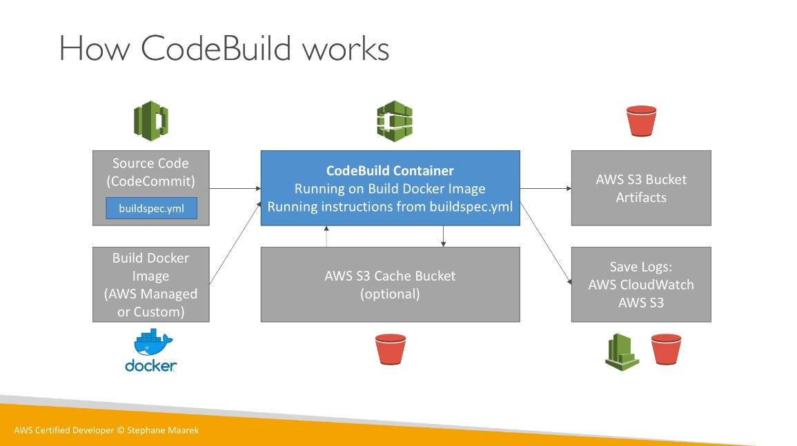

# CodeBuild

* Fully managed build service.
* Alternative to other build tools such as Jenkins.
* Continuous scaling (no servers to manage or provision - no build queue).
* Pay for usage, i.e. the time it takes to complete the builds.
* Leverages Docker under the hood.
* Possibility to extend capabilities leveraging our own base Docker images.
* Secure: Integration with KMS for encrpytion of build artifacts, IAM for build permissions, and VPC for network security, CloudTrail for API calls logging.

* `buildspec.yml` is the build instructions, must be at the **root** of your code.
* Define environmental variables:
  * Plaintext variables
  * Secure secrets: Use SSM Parameter store.
* Phases (specify commands to run):
  * Install: install dependencies you may need for your build.
  * Pre-build: final commands to execute before build.
  * **Build: actual build commands**
  * Post-build: finishing touches (zip output for example)
* Artifacts: What to upload to S3 (encrypted with KMS).
* Cache: Files to cache (usually dependencies) to S3 for future build speedup.

## CodeBuild Local Build

* In case you need deep troubleshooting beyond logs.
* You can run CodeBuild locally on your desktop (after installing Docker)
* For this, leverage the [CodeBuild Agent](https://docs.aws.amazon.com/codebuild/latest/userguide/use-codebuild-agent.html).
