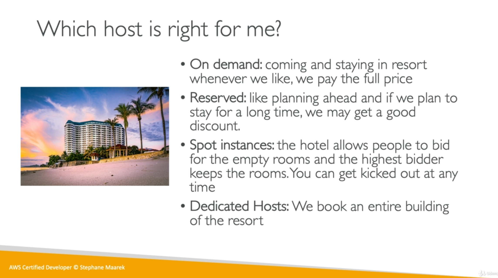

# EC2 Instance Launch Types

* On Demand Instances: short workloads, predictable pricing.
* Reserved Instances: long workloads (>= 1 year)
* Convertible Reserved Instances: long workloads with flexible instances.
* Scheduled Reserved Instances: Launch within time window you reserve.
* Spot Instances: bid on instance. Short workloads, for cheap. Can lose instances.
* Dedicated Instances: No other customers will share your hardware.
* Dedicated Hosts: book an entire physical server, control instance placement.

## On Demand

* Pay for what you use (billing per second, after the first minute).
* Has the highest cost but no upfront payment.
* No long term commitment
* Recommended for short-term and un-interrupted workloads, where you can't predict how the application will behave.

## Reserved Instances

* Up to 75% discount compared to on demand.
* Pay upfront for what you use with long term commitment.
* Reservation period can be 1 or 3 years.
* Reserve a specific instance type.
* Recommended for steady stage usage applications (think database).

### Convertible Reserved Instance

* Can change the EC2 instance type
* Up to 54% discount.

### Scheduled Reserved Instances

* Launch within time window you need
* e.g. midnight on Fridays

## Spot Instances

* Can get a discount of up to 90% comperad to on demand.
* You bid a price and get the instance as long as it's under the price.
* Price varies based on offer and demand.
* Spot instances are reclaimed with a 2 minute notification warning when the spot price goes above your bid.
* Used for batch jobs, Big Data analysis, or workloads that are resilient to failures.
* Not great for critical jobs or databases.
* You can lose the instance at any point of time.

## Dedicated Hosts

* Dedicated physical server for your use.
* Full control of instance placement.
* Visibility into the underlying sockets / physical cores of the hardware.
* Allocated for your account for a 3 year period reservation.
* More expensive.
* Useful for software that have complicated licensing model (Bring Your Own License).

## Dedicated Instances

* instances running on hardware that's dedicated to you.
* May share hardware with other instances in same account.
* No control over instance placement (can move hardware after Stop / Start).
