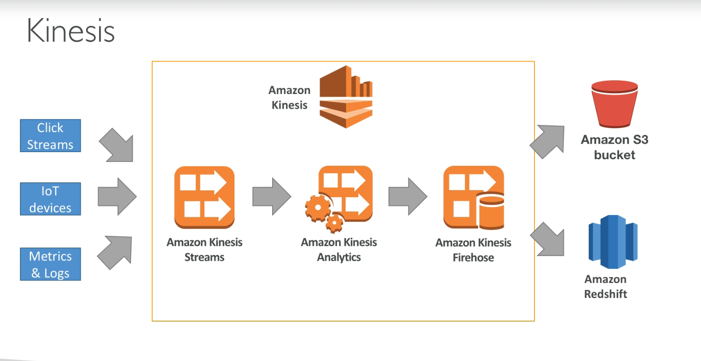
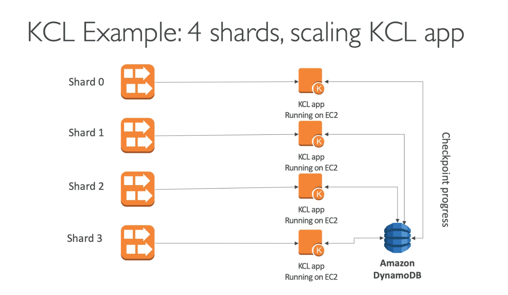

# Kinesis

- Kinesis is a managed alternative to Apache Kafka.
- Great for application logs, metrics, IoT, clickstreams.
- Great for "real-time" big data.
- Great for streaming processing frameworks (Spark, NiFi, etc.).
- Data is automatically replicated to 3 availability zones (AZ).

Three Kinesis products:

1. **Kinesis Streams**: low latency streaming ingest at scale.
2. **Kinesis Analytics**: perform real-time analytics on streams using SQL.
3. **Kinesis Firehose**: load streams into S3, Redshift, ElasticSearch...

## Kinesis Streams Overview

- Streams are divided in ordered Shards / Partitions.
- Data retention is 1 day by default, can go up to 7 days.
- Ability to reprocess / replay data.
- Multiple applications can consume the same stream.
- Real-time processing with scale of throughput
- Once data is inserted in Kinesis, it can't be deleted (immutability).

## Kinesis Streams Shards

- One stream is made of many different shards.
- 1MB/s or 1000 messages/s at write PER SHARD.
- 2MB/s at read PER SHARD
- Billing is per shard provisioned, can have as many shards as you want.
- Batching available or per message calls.
- The number of shards can evolve over time (reshard / merge)
- **Records are ordered per shard**

## API - Put records

- `PutRecord` API + partition key that gets hashed.
- The same key goes to the same partition (helps with ordering for a specific key)
- Messages sent get a "sequence number"
- Choose a partition key that is highly distributed (helps prevent "hot partition")
  - `user_id` if many users
  - Not `country_id` if 90% of the users are in one country
- Use batching with `PutRecords` to reduce costs and increase throughput.
- `ProvisionedThroughputExceeded` if we go over the limits.
- Can use CLI, AWS SDK, or producer libraries from various frameworks.

## KCL

- Kinesis Client Library (KCL) is a Java library that helps read record from a Kinesis Streams with distributed applications sharing the read workload.
- Rule: each shard is to be read by only one KCL instance.
- Means 4 shards = max 4 KCL instances.
- Progress is checkpointed into DynamoDB (need IAM access).
- KCL can run on EC2, Elastic Beanstalk, on-premise applications.
- Records are read in order at the shard level.

