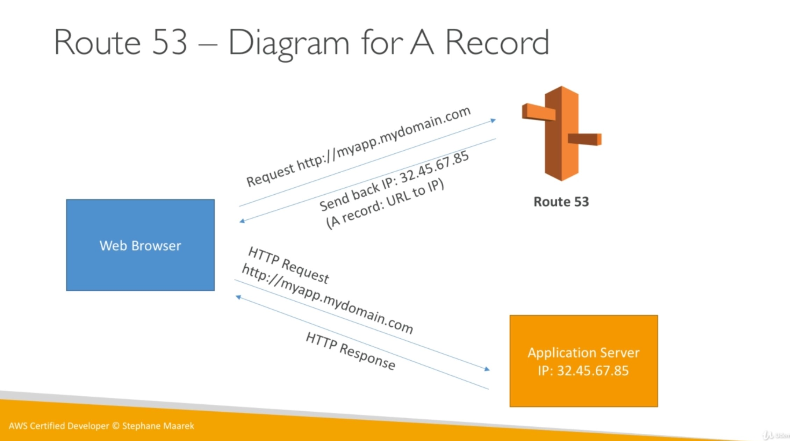

# Route 53

The most common records are:

* A record: URL to IPv4.
* AAAA record: URL to IPv6.
* CNAME: URL to URL.
* Alias: URL to AWS resource.

Route 53 can use:

* Public domain names you own (or buy), i.e. application1.mypublicdomain.com
* Private domain names that can be resolved by your instances in your VPCs, i.e. application1.company.internal

Route 53 has advanced features such as:

* Load balancing (through DNS - also called client load balancing).
* Health checks (although limited)
* Routing policy: simple, failover, geolocation, geoproximity, latency, weighted.

You should use Alias over CNAME for AWS resources for performance reasons.
