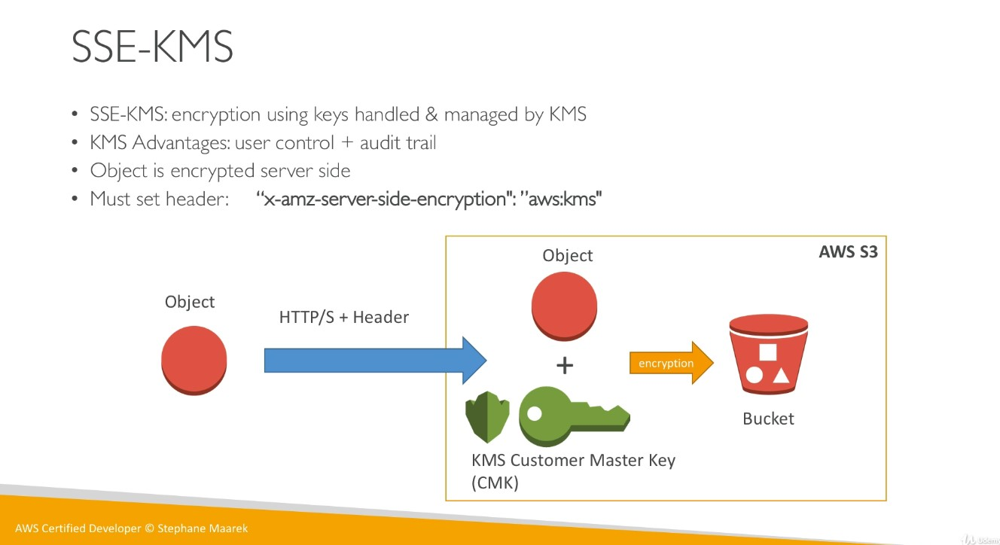

# Amazon S3

Amazon S3 allows people to store objects (files) in buckets (directories).

Buckets must have a **globally unique name**. Buckets are defined at the region level.

Naming convention:

* No uppercase
* No underscore
* 3-63 characters long
* Not an IP address
* Must start with lowercase letter or number

Objects (files) have a Key. The key is the full path:

* `<my_bucket>/my_file.txt`
* `<my_bucket>/my_folder1/another_folder/my_file.txt`

There are no concepts of directories within buckets.

Object values are the content of the body. The max size is 5TB. If you're uploading more than 5GB, you must use **multi-part upload**.

## Versioning

You can version files in S3 at a bucket level. It's best practice to version your buckets.

* Protect against unintended deletes (ability to restore a version).
* Easy roll back to previous version.

Any file that is not versioned prior to enabling versioning will have version "null."

When you "delete" a file that is versioned, it doesn't actually delete it. It adds a delete marker and hides it, so you can enable it at any time.

## Encryption

There are 4 methods of encrypting objects in S3.

* SSE-S3: encrypts S3 objects using keys handled and managed by AWS.
* SSE-KMS: leverage AWS Key Management Service to manage encryptions keys.
* SSE-C: when you want to manage your own keys.
* Client Side Encryption.

### SSE-S3

* SSE-S3: encryption using keys handled and managed by AWS S3.
* Object is encrypted server-side.
* AES-256 encryption type.
* Must set header: `"x-amz-server-side-encryption":"AES256"`

### SSE-KMS

* SSE-KMS: encryption using keys handled and managed by KMS.
* KMS Advantages: user control and audit trail.
* Object is encrypted server side.
* Must set header: `"x-amz-server-side-encryption": "aws:kms"`

### SSE-C

* SSE-C: server-side encryption using data keys fully managed by the customer outside of AWS.
* S3 does not store the encryption key you provide.
* **HTTPS must be used.**
* Encryption key must be provided in HTTP headers, for every HTTP request made.

### Client Side Encryption

* Client library such as the Amazon S3 Encryption Client
* Clients must encrypt data themselves before sending to S3.
* Clients must decrypt data themselves when retrieving from S3.
* Customer fully manages the keys and encryption cycle.

### Encryption in transit (SSL)

Encryption in flight is also called SSL / TLS.

## S3 Security

* User based
  * IAM policies: which API calls should be allowed for a specific user from IAM console.
* Resource Based
  * Bucket policies - bucket wide rules from the S3 console. Allows cross account. More popular.
  * Object Access Control List (ACL) - finer grain
  * Bucket Access Control List (ACL) - less common

### S3 Bucket Policies

* JSON based policies
  * Resources: buckets and objects
  * Actions: Set of API to Allow or Deny.
  * Effect: Allow / Deny.
  * Principal: The account or user to apply the policy to.
* Use S3 bucket for policy to:
  * Grant public access to the bucket.
  * Force objects to be encrypted at upload.
  * Grant access to another account (Cross Account)

### S3 Security - Other

* Networking:
  * Supports VPC Endpoints (for instances in VPC without internet access)
* Logging and Audit:
  * S3 access logs can be stored in other S3 bucket
  * API calls can be logged in AWS CloudTrail.
* User Security
  * MFA can be required in versioned buckets to delete objects.
  * Signed URLs: URLs that are valid only for a limited time (ex: premium video service for logged in users).

## S3 CORS

If you request data from another S3 bucket, you need to enable CORS.

Cross Origin Resource Sharing (CORS) allows you to limit the number of websites that can request your files in S3 (and limit your costs).

## Consistency Model

* Read after write consistency for PUTS of new objects.
  * As soon as an object is written, we can retrieve it. ex: PUT 200 -> GET 200
  * This is true, **except** if we did a GET before to see if the object existed. ex: GET 404 -> PUT 200 -> GET 404, eventually consistent.
* Eventual consistency for DELETS and PUTS of existing objects.
  * If we read an object after updating, we might get the older version.
  * If we delete an object, we might still be able to retrive it for a short time.

## S3 Performance

* Faster upload of larger objects (>= 100MB), use multipart upload.
  * Parallelizes PUTs for greater throughput.
  * Maximize your network bandwidth and efficiency.
  * Decrease time to rety in case a part fails.
  * Must use multi-part if object size is greater than 5GB.
* Use CloudFront to cache S3 objects around the world (improves reads).
* S3 Transfer Acceleration (uses edge locations) - just need to change the endpoint you write to, not the code.
* If you're using SSE-KMS encryption, you may be limited to your AWS limits for KMS usage (~100s - 1000s downloads / uploads per second).
