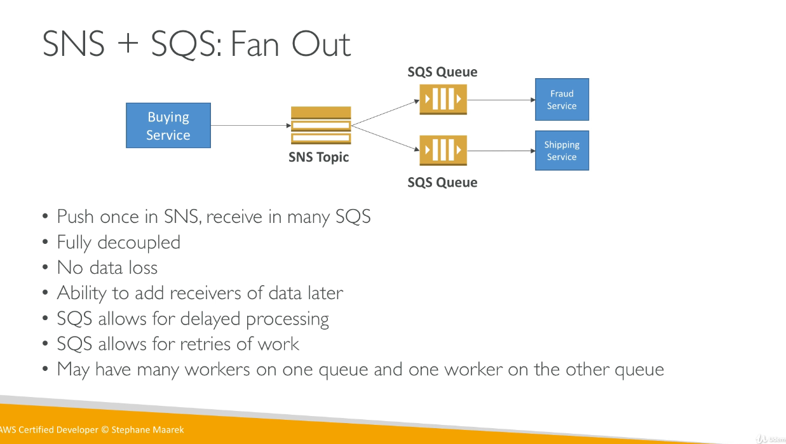

# Simple Notification System (SNS)

- The event producer only sends one message to one SNS topic.
- As many event receivers as we want to listen to the SNS topic notifications.
- Each subscriber to the topic will get all the messages (note: new feature to filter messages)
- Up to 10,000,000 (10 million) subscriptions per topic.
- 100,000 topics limit
- Subscribers can be:
  - SQS
  - HTTP / HTTPS (with delivery retries)
  - Lambda
  - Emails
  - SNS messages
  - Mobile notifications

## SNS Integrations

- Some services can send data directly to SNS for notifications
- CloudWatch (for alarms)
- Auto scaling groups notifications
- S3 (on bucket events)
- CloudFormation (upon state changes => failed to build, etc.)
- etc...

## How to Publish to SNS

- Topic Publish (within your AWS server, using the SDK)
  - Create a topic
  - Create a subscription (or many)
  - Publish to the topic
- Direct Publish (for mobile apps SDK)
  - Create a platform application
  - Create a platform endpoint
  - Publish to the platform endpoint
  - Works with Google GCM, Apple APNS, Amazon ADM...

## SNS + SQS: Fan Out

- Push once in SNS, receive in many SQS.
- Fully decoupled
- No data loss
- Ability to add receivers of data later.
- SQS allows for delayed processing
- SQS allows for retries of work
- May have many workers on one queue and one worker on the other queue.
