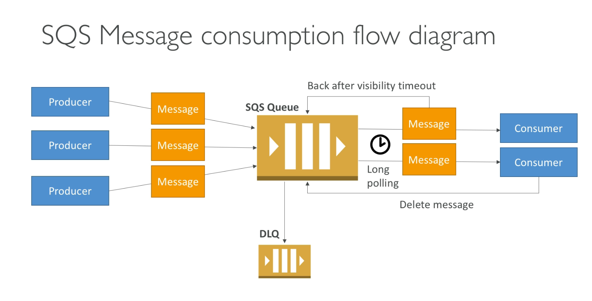

# Simple Queue Service (SQS)

- Scales from 1 message per second to 10,000s per second.
- Default retention of messages: 4 days, maximum of 14 days.
- No limit to how many messages can be in the queue.
- Low latency (<10ms on publish and receive)
- Horizontal scaling in terms of number of consumers.
- Can have duplicate messages (at least once delivery, occasionally).
- Can have out of order messages (best effort ordering).
- Limitation of 256kb per message sent. Don't send videos or images, many times just JSON.

There are **producers** who create the messages, and **consumers** where the messages go to.

## Delay Queue

- Delay a message (consumers don't see it immediately) up to 15 minutes.
- Default is 0 seconds (message is available right away).
- Can set a default at queue level.
- Can override the default using the **DelaySeconds** parameter.

## Producing Messages

- Define body
- Add message attributes (metadata - optional)
- Provide delay delivery (optional)
- Get back a message identifier, and MD5 hash of the body.

## Consuming Messages

- Consumers poll SQS for messages (receive up to 10 messages at a time)
- Process the message within the visibility timeout
- Delete the message using the message ID and receipt handle

## Visibility Timeout

- When a consumer polls a message from a queue, the message is "invisible" to other consumers for a defined period. Known as **visibility timeout**.
  - Set between 0 seconds and 12 hours (default is 30 seconds)
  - If too high (15 minutes) and consumer fails to process the message, you must wait a long time before processing the message again.
  - If too low (30 seconds) and consumer needs time to process the message (2 minutes), another consumer will receive the message and the message will be processed more than once.
- **ChangeMessageVisibility** API to change the visibility while processing a message.
- **DeleteMessage** API to tell SQS the message was successfully processed.

## Dead Letter Queue

- If a consumer fails to process a message within the Visibility Timeout, the message goes back to the queue.
- We can set a threshold of how many times a message can go back to the queue. It's called a "redrive policy."
- After the threshold is exceeded, the message goes into a dead letter queue (DLQ).
- We have to create a DQL first and then designate it dead letter queue.
- Make sure to process the messages in the DLQ before they expire.

## Long Polling

- When a consumer requests a message from the queue, it can optionally "wait" for messages to arrive if there are none in the queue.
- **LongPolling** decreases the number of API calls made to SQS while increasing the efficiency and latency of your application.
- The wait time can be between 1 sec to 20 seconds. (20 sec preferable)
- Long Polling is preferred to Short Polling.
- Long polling can be enabled at the queue level or at the API level using **WaitTimeSeconds**.

## FIFO - First In, First Out

- Newer offering, not available in all regions.
- Name of the queue must end in `.fifo`.
- Lower throughput (up to 3,000 per second with batching, 300/s without)
- Messages are processed in order by the consumer.
- Messages are sent exactly once.
- No per message delay (only per queue delay).

## FIFO Features

- Deduplication: not sending the same message twice.
  - Provide a `MessageDeduplicationId` with your message.
  - De-duplication interval is 5 minutes.
  - Content based deduplication: the `MessageDeduplicationId` is generated as the SHA-256 of the message body (not the attributes).
- Sequencing
  - To ensure strict ordering between messages, specify a `MessageGroupId`
  - Messages with different Group ID may be received out of order.
  - e.g. to order messages for a user, you could use the `user_id` as a group ID.
  - Messages with the same Group ID are delivered to one consumer at a time.

## SQS Extended Client

- Message size limit is 256kb, to send larger messages use the SQS Extended Client (Java library). Images, videos, etc.
- Sends large messages to S3, then sends small metadata message to the SQS Queue.

## SQS Security

- Encryption in transit using the HTTPS endpoint.
- Can enable SSE (Server Side Encryption) using KMS.
  - Can set the CMK (Customer Master Key) we want to use.
  - Can set the data key reuse period (between 1 minute and 24 hours)
    - Lower and KMS API will be used often.
    - Higher and KMS API will be called less.
  - SSE only encrypts the body, not the metadata (message ID, timestamp, attributes).
- IAM policy must allow usage of SQS.
- SQS queue access policy.
  - Finer grained control over IP.
  - Control over the time the requests come in.
- No VPC endpoint, must have internet access to access SQS.

## Must know API

- `CreateQueue`, `DeleteQueue`
- `PurgeQueue`: delete all the messages in queue.
- `SendMessage`, `ReceiveMessage`, `DeleteMessage`
- `ChangeMessageVisibility`: change the timeout
- Batch APIs for `SendMessage`, `DeleteMessage`, `ChangeMessageVisibility` helps decrease your costs.
