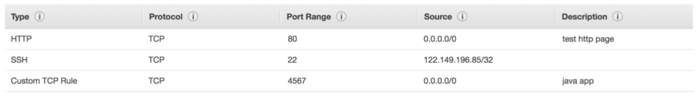

# EC2

## AWS Regions

AWS has regions all around the world (us-east-1).

Each region has **availability zones** (AZ) (us-east-1a, us-east-1b...). Can go up to 6 currently, most are upwards 3.

* us-east-1a
* us-east-1b
* us-east-1c
* us-east-1d
* us-east-1e
* us-east-1f

Each availability zone is a **physical data center** in the region, but separate from one another (so that they're isolated from disasters).


AWS Consoles are region scoped (except IAM and S3).

## What is EC2?

EC2 mainly consists in the capability of:

* Renting virtual machines (EC2).
* Storing data on virtual drives (EBS).
* Distributing load across machines (ELB).
* Scaling the services using an auto-scaling group (ASG).

**AMI** (Amazon Machine Image) is the software and operating system that is launched on a server.

An AMI is a template that contains the software configuration (operating system, application server, and applications) required to launch your instance.

**Security Groups** are similar to firewalls.

## SSH

To SSH into an instance, use the following command:

``` bash
ssh -i <path to pem file> <user>@<ip address>
ssh -i C:\Users\name\Downloads\instance.pem ec2-user@11.111.111.11
```

## Security Groups

Security Groups control how traffic is allowed into or out of our EC2 machines.


Security Groups allows us to open instances up for SSH, HTTP, HTTPS, etc.

Security groups act as a firewall on EC2 instances. They regulate:

* Access to ports
* Authorized IP ranges - IPv4 and IPv6.
* Control of inbound network (from other to the instance)
* Control of outbound network (from the instance to other).



Security groups good to know facts:

* Can be attached to multiple instances.
* Locked down to a region / VPC combination.
* Lives outside the EC2. If traffic is blocked, the instance won't see it.
* It's good to maintain one separate security group for SSH access.
* If your application is not accessible (time out), then it's a security group issue.
* If your application gives a "connection refused" error, then it's an application error or it's not launched.
* All inbound traffic is **blocked** by default.
* All outbound traffic is **authorized** by default.

## IPs

* When you stop and then start an EC2 instance, it can change its public IP.
* If you need to have a fixed public IP for your instance, you need an **Elastic IP**.
* An Elastic IP is a public IPv4 IP you own as long as you don't delete it.
* You can attach it to one instance at a time.
* With an Elastic IP address, you can mask the failure of an instance or software by rapidly remapping the address to another instance in your account.
* You can only have 5 Elastic IPs in your address (you can ask AWS to increase it).
* Overall, try to avoid using Elastic IPs.
  * They often reflect poor architectural decisions.
  * Instead, use a random public IP and register a DNS name to is.
  * Or use a Load Balancer and don't use an Elastic IP.

By default, your EC2 machine comes with:

* A private IP for the internal AWS network.
* A public IP, for the www.

When we are SSHing into our EC2 machines:

* We can't use a private IP, because we are not in the same network.
* We can only use the public IP.
* If your machine is stopped and then started, the public IP can change.

## Install Apache

1. SSH into EC2 instance.
2. `sudo su`: elevate rights
3. `yum update -y`: update software
4. `yum install httpd`: install Apache
5. `systemctl start httpd.service`: start Apache.
6. `systemctl enable httpd.service`: enable Apache on all boots.
7. `curl localhost:80`: Display the contents of the server.
8. Make sure the Security Group allows inbound traffic.
9. Add website files, `echo "Hello World" > /var/www/html/index.html`.

## EC2 User Data

* It's possible to bootstrap our instances using an EC2 user data script.
* **bootstrapping** means launching commands when a machine starts.
* That script is only run once at the instance first start.
* EC2 user data is used to automate boot tasks such as:
  * Installing updates.
  * Install software.
  * Download common files from the internet.
  * Anything you can think of.
* The EC2 User Data Script runs with the root user.

We're going to write a script to make sure that the EC2 instance has an Apache server installed on it to display a simple web page.

``` bash
#!/bin/bash
yum update -y
yum install -y httpd
systemctl start httpd.service
systemctl enable httpd.service
echo "Hello world from $(hostname -f)" > /var/www/html/index.html
```
