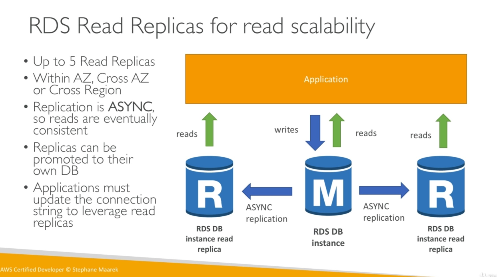
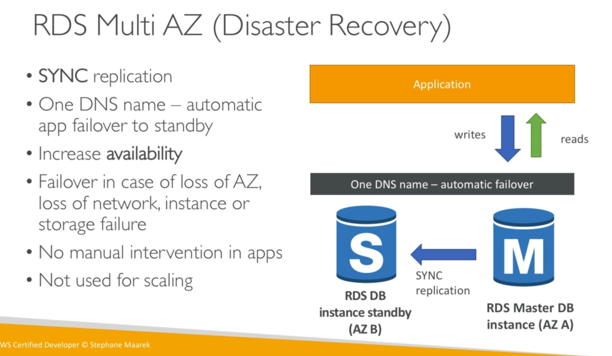

# RDS

Advantages for using RDS versus deploying a database on EC2.

* Managed service
* OS patching level
* Continuous backups and restore to specific timestamp (point in time restore)
* Monitoring dashboards
* Read replicas for improved read performance
* Multi AZ setup for disaster recovery.
* Maintenance windows for upgrades
* Scaling capability (vertical and horizontal)
* BUT you can't SSH into your instances.

## Read Replicas

* Up to 5 read replicas.
* Within AZ, cross AZ, or cross region.
* Replication is ASYNC, so reads are eventually consistent.
* Replicas can be promoted to their own DB.
* Applications must update the connection string to leverage read replicas.

## RDS Multi AZ (Disaster Recovery)

## RDS Backups

Backups are automatically enabled.

* Daily full snapshot of the database.
* Capture transaction logs in real time
* Ability to restore to any point in time.
* 7 days retention (can be increased to 35 days).

DB Snaphots:

* Manually triggered by the user.
* Retention of backup for as long as you want.

## RDS Encryption

* Encryption at rest capability with AWS KMS - AES-256 encryption.
* SSL certificates to encrypt data to RDS in transit.
* To enforce SSL:
  * PostgreSQL: `rds.force_ssl=1` in the AWS RDS Console (Parameter Groups).
  * MySQL: Within the database, `GRANT USAGE ON *.* TO 'mysqluser'@'%' REQUIRE SSL;`

To connect using SSL:

* Provide the SSL Trust certificate (can be downloaded from AWS).
* Provide SSL options when connecting to database.

## RDS Security

* RDS databases are usually deployed within a private subnet, not in a public one.
* RDS security works by leveraging security groups (the same concept as for EC2 instances) -- it controls who can **communicate** with RDS.
* IAM policies help control who can **manage** RDS.
* Traditional username and password can be used to **login** to the database.
* IAM users can now be used too for MySQL / Aurora.

## RDS vs. Aurora

* Aurora is a proprietary technology from AWS (not open sourced).
* Postgres and MySQL are both supported as Aurora DB (that means your drivers will work as if Aurora was a Postgres or MySQL database.)
* Aurora is "AWS cloud optimized" and claims 5x performance improvement over MySQL on RDS, over 3x the performance of Postgres on RDS.
* Storage automatically grows in increments of 10GB, up to 64TB.
* Can have 15 replicas while MySQL has 5, and the replication process is faster (sub 10ms replica lag).
* Failover in Aurora is instantaneous. It's HA native.
* Aurora costs more than RDS (20% more) -- but is more efficient.
